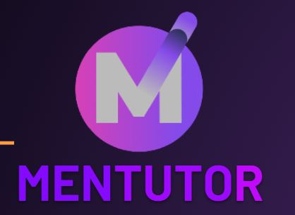

<div align="center">
  <h1>Welcome to Mentutor</h1>

<!-- PROJECT LOGO -->


</div>

## 📃About The Project

### Application Under Test | Mentutor

Mentutor is the app that exclusively crafted by developer which attend the Intents Meeting of Mantee and Mentor to interact using Forum Feature and monitor on mentee performance. Mentor also can add task and gives mark on mentee's submission. This app is exclusively created because only admin can add user, both as mentor or mentee.


## 🛠 Tools
**Manual:**  


**Automation:**  


**Framework for automation:**  


**Test Case Management:**  
[]([https://docs.google.com/spreadsheets/d/1Z9_OOaHYA0vtr8zDXoA1mKcc-8PBHyUO5ON9oalO_nc/edit#gid=1997120373](https://docs.google.com/spreadsheets/d/1zuVMxx3K63G_BOLJE-J81Z9HrGK9gp3bKD4GD69kiCM/edit?usp=sharing))

**Communication:**  
[](https://github.com/orgs/Capstone-Group3-Mentutor/projects/1/views/1)


## Getting Started

This is an example of how you may give instructions on setting up your project locally.
To get a local copy up and running follow these simple example steps.

### Prerequisites

- Java 1.8
- Maven
- Gherkin for Java
- Cucumber

### Installation

   ```sh
   git clone https://github.com/Capstone-Group3-Mentutor/QE-API.git
   ```

### Usage

   ```sh
   mvn clean verify
   ```

<br/>

## Tested Feature Coverage

### Authorization

- Login

### CRUD Data Flow

- User Management
- Class Management
- Task Management
- Score Submission
- Forum feature
- Comment feature
- Profile Authentication and Data Modification
- Class Modification

### Input Field Validation
- DataType validation
- FileType validation

## 📱 Our teams

  [](https://www.linkedin.com/in/lutfiyan-riza-amada/)
  [](https://github.com/lutfiyanra/)

  [](https://www.linkedin.com/in/rezkiadina/)
  [](https://github.com/rezkiadina)

  [](https://www.linkedin.com/in/rimasya-ayu-jaeningsih-09344b150/)
  [](https://github.com/rimasya/)

  []( https://www.linkedin.com/in/hanifah-fuadi-4707418b)
  [](https://github.com/HanifahFuadi/)
